# Introduction {background-image="images/bg.jpeg" background-opacity="0.2"}

## Rationale -- Key Context

- Industry 5.0 is reshaping education toward **human–machine collaboration and digital skill integration** [@xu21; @al-emran22]
- Mathematics education must adapt by integrating **ICT, data literacy, and computational tools** for problem-solving and real-world applications [@manyika11]
- Philippine education faces persistent **performance and digital gaps**, as shown in PISA results and ICT readiness issues [@oecd24; @servallos23]

::: notes
Industry 5.0 requires stronger integration of digital and computational skills in education. Mathematics teaching must therefore shift toward ICT and data-driven approaches. In the Philippines, existing learning and digital gaps highlight the need for this alignment.
:::

## Rationale -- Educational Response

- Need for **ICT integration in Mathematics in the Modern World (MMW)** to develop data and coding competencies aligned with Industry 5.0 [@cmo-20-13; @oecd24]
- Opportunity to use **open-source tools in mathematics education (e.g., R and RStudio)** to support accessible, cost-effective data analysis and learning [@gandrud20; @cetinkaya-rundel21]
- **Flexible learning during COVID-19** highlighted the need for technology-enabled, adaptable learning systems [@cmo-04-20]

::: notes
Building from the need for Industry 5.0 alignment, mathematics education must now respond through practical integration of technology in instruction. Focusing on MMW, this means strengthening ICT use to develop students’ data and coding skills. Open-source tools like R and RStudio offer accessible solutions for this. The shift was further reinforced during COVID-19, where flexible learning exposed the importance of adaptable, technology-supported education systems.
:::

## Rationale -- Why Flexible Learning?

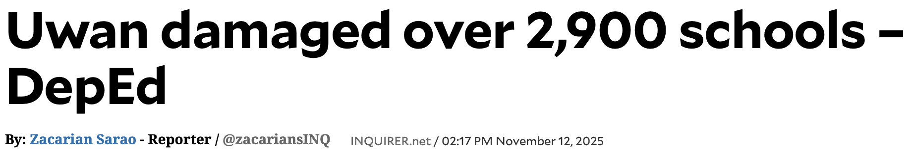{width=80%}

{width=80%}

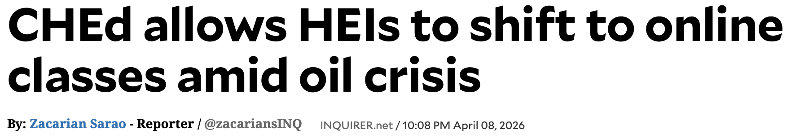{width=80%}

::: notes
Furthermore this is being highlighted by class disruptions brought about by extreme weather events like super typhoons and high heat index. And also the current energy crisis we are facing because of the war in the middle east.
:::

## Theoretical Framework

1. Transactional Distance Theory [@moore93]
2. Flexible Learning [@alokaily2023]
3. Technological, Pedagogical, and Content Knowledge (TPACK) [@lisenbee20]

::: notes
These are the theories that guided the study.
:::

## Conceptual Framework

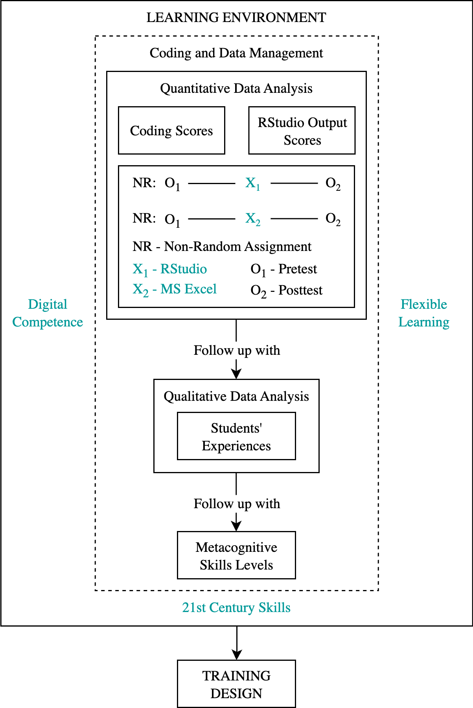

::: notes
For the conceptual framework, this is the research paradigm.
:::

## Objectives {.smaller}

1. To determine the performance of the students using R and RStudio in:

    1.1 Coding
    
    1.2 Data Management
2. To determine the effect of using MS Excel and R and RStudio in the performance of students in Data Management.
3. To describe the experiences of the students in using MS Excel and R and RStudio.
4. To describe the metacognitive skills of students in decision-making.
5. To propose a training design on the use of statistical programming language in teaching Coding and Data Management.

::: notes
To address the changing demands of mathematics education, this study examined pre-service teachers’ experiences, metacognitive skills, and performance in coding and data management using R and RStudio or Microsoft Excel when they were enrolled in Mathematics in the Modern World course conducted in a flexible learning environment. The findings aimed to inform professional development programs for mathematics educators.
:::

## Statement of the Null Hypotheses

- $H_{01}$: There is no significant difference between pretest scores and the posttest scores of the students in both groups.
- $H_{02}$: There is no significant difference in the posttest scores between the two groups when pretest scores are statistically treated as covariates.

# Methodology {background-image="images/bg.jpeg" background-opacity="0.2"}

## Research Design

**Explanatory Sequential Mixed Methods**

:::: {.columns}

::: {.column width="60%"}
  + Quantitative Phase
    - Quasi-experimental Design

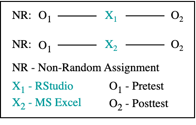

:::

::: {.column width="40%"}
+ Qualitative Analysis
    - Thematic Analysis
    
:::
::::

::: notes
The study used an explanatory sequential mixed methods design—quantitative first, then qualitative to explain the results.
A quasi-experimental pretest–posttest non-randomized two-group design compared the performance of the participants using RStudio and Microsoft Excel.
The qualitative phase explored students’ experiences through thematic analysis.
:::

## Research Environment

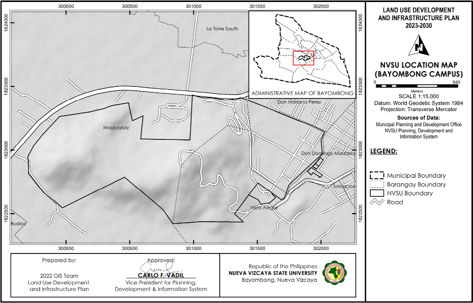{width=200px}

::: notes
The study was conducted at Nueva Vizcaya State University – Bayombong Campus, involving students from the College of Teacher Education.
::: 

## Research Participants 

- Purposive Sampling
- First Year Students
- Enrolled in Mathematics in the Modern World
- 25 BSEd Mathematics | RStudio
- 22 BSEd General Science | MS Excel

::: notes
Participants were selected through purposive sampling, with group assignment done through randomization.
:::

## Instrumentation {.smaller}

:::: {.columns}
::: {.column width="60%"}
**Objective 1**

- Evaluation Checklist for Coding 
  + 30 Items
  + Created

- Evaluation Checklist for the RStudio Output
  + 35 Items
  + Created

**Objective 2**

- Knowledge Test for Data Management
  + 21 Items
  + 44 Points
  + Adopted (no-citation requirement)

:::
::: {.column width="40%"}
**Objective 3**

- Semi-structured Questionnaire
  + 7 Open-ended Questions
  + Created

**Objective 4**

- Metacognitive Skills Scale (MSS)
  + 30 Items
  + 5-point Likert Scale
  + Strongly Disagree to Strongly Agree
  + Adopted [@altindag2013]

:::
::::

::: notes
The study used five instruments to address 4 of the 5 objectives of the study. These instruments were validated, tested for reliability, and were used with proper permission.
:::

## Data Gathering Procedure {.smaller}

- Conducted in November 2024 (1st Semester, AY 2024–2025)
- Implemented a four-week instructional intervention

**Procedure Overview**: Pretest and orientation → progressive data analysis (univariate, bivariate, multivariate) → linear regression → posttest

**Tools Utilized**: R/RStudio (Posit Cloud) for the experimental group; Microsoft Excel for the positive control group; myOpenMath for pretest and posttest administration

**Data Sources**: RStudio output, Metacognitive Skills Scale (MSS), and semi-structured questionnaire

**Ethical Compliance**: Institutional approval obtained, informed consent secured, and adherence to the Data Privacy Act of 2012 ensured

::: notes
Data were gathered over a four-week intervention in November 2024, from pretest to posttest.
R/RStudio through posit cloud and MS Excel were used for instruction, while myOpenMath was used for assessments.
Data sources included student report outputs, the MSS, and the semi-structured questionnaire, with all ethical protocols observed.
:::

## Data Treatment

- **Descriptive Statistics**: Mean, SD, frequency, percentage
- **Inferential Analysis**: t-tests and Quade’s test
- **Qualitative Analysis**: Thematic analysis [@braun22]
- **Mixed Methods**: Integration of quantitative and qualitative results
- **Training Design**: CPD program developed based on findings (PRC framework)
- **Tool**: R and RStudio [@r25]

:::notes
Data were analyzed using descriptive and inferential statistics, including t-tests and Quade’s test.
Qualitative data were examined through thematic analysis, and findings were integrated using a mixed methods approach.
Based on the results, a CPD training design was developed following the PRC framework, with all analyses performed in R and RStudio.
:::

# Results & Discussion {background-image="images/bg.jpeg" background-opacity="0.2"}

---

#### Performance of Students Using R and RStudio in Coding

:::: {.columns}
::: {.column width="65%"}
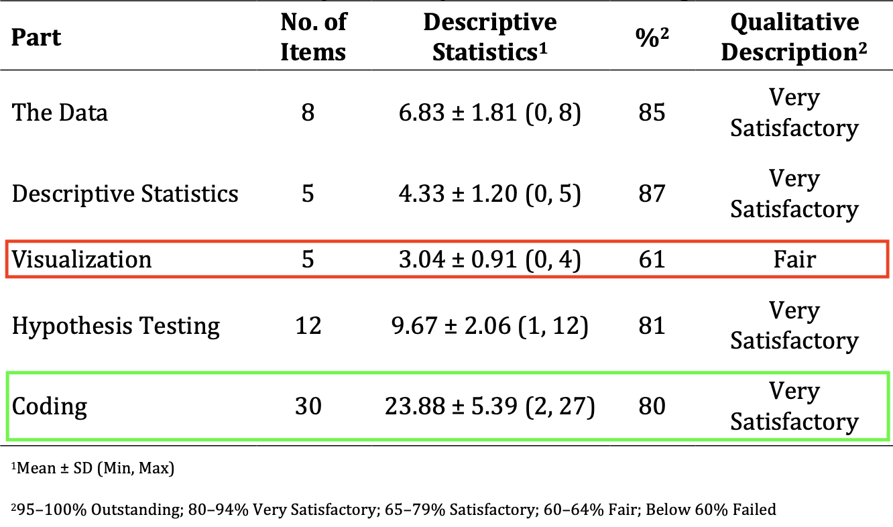
:::
::: {.column width="35%"}
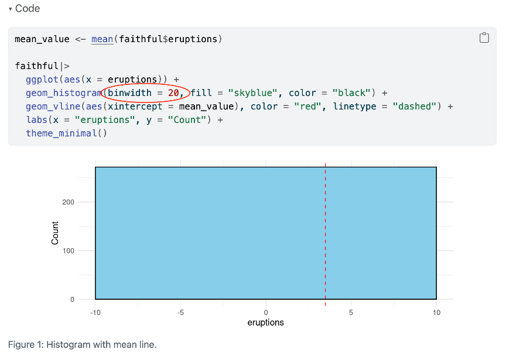{width=60%}

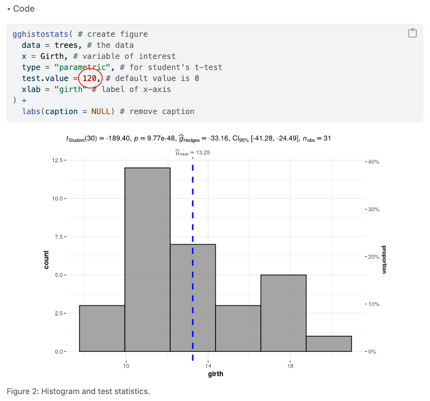{width=60%}

:::
::::

::: notes
Most students demonstrated very satisfactory coding performance using R and RStudio, particularly in formatting, organization, and reproducible report structure.
They performed well in descriptive tasks, such as data presentation and basic statistics.
However, performance declined in more complex tasks like data visualization and hypothesis testing, where errors in variable mapping, parameter selection, and assumptions were observed.
Overall, while students showed proficiency in syntax and structure, they lacked deeper statistical reasoning and independent coding skills, highlighting the need for more focused instruction in interpretation and analytical thinking.
Some mistakes were Incorrect Binwidth, Inappropriate Test Value
:::

---

#### Performance of Students Using R and RStudio in Data Management

:::: {.columns}
::: {.column width="65%"}
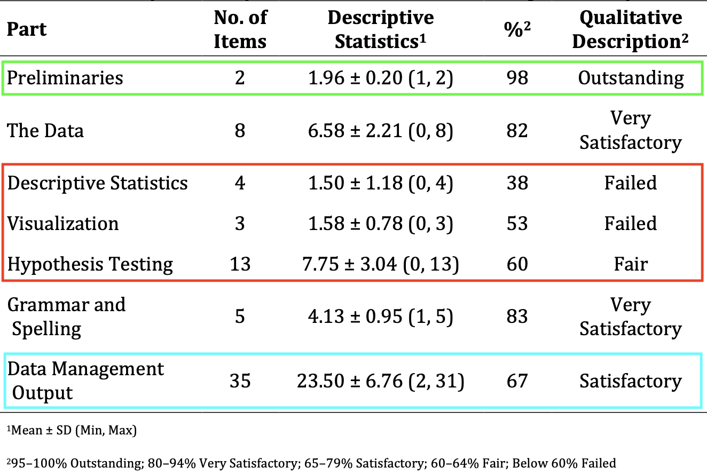
:::
::: {.column width="35%"}
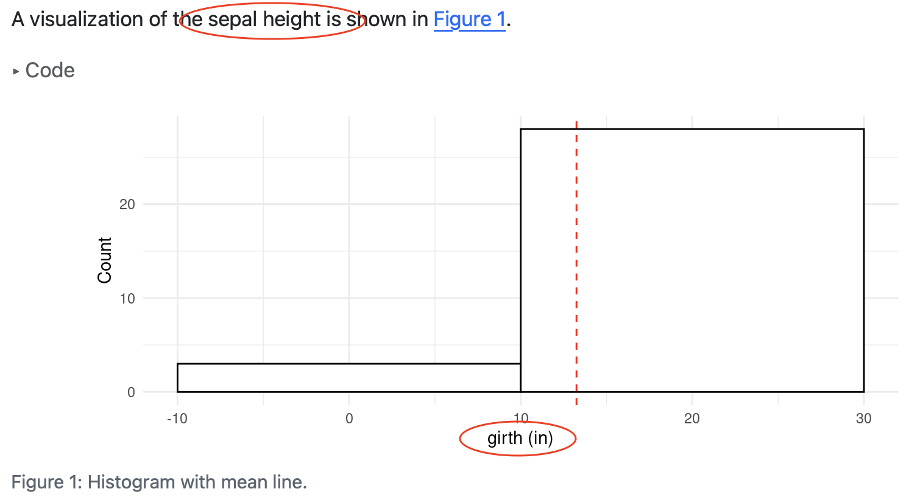{width=60%}

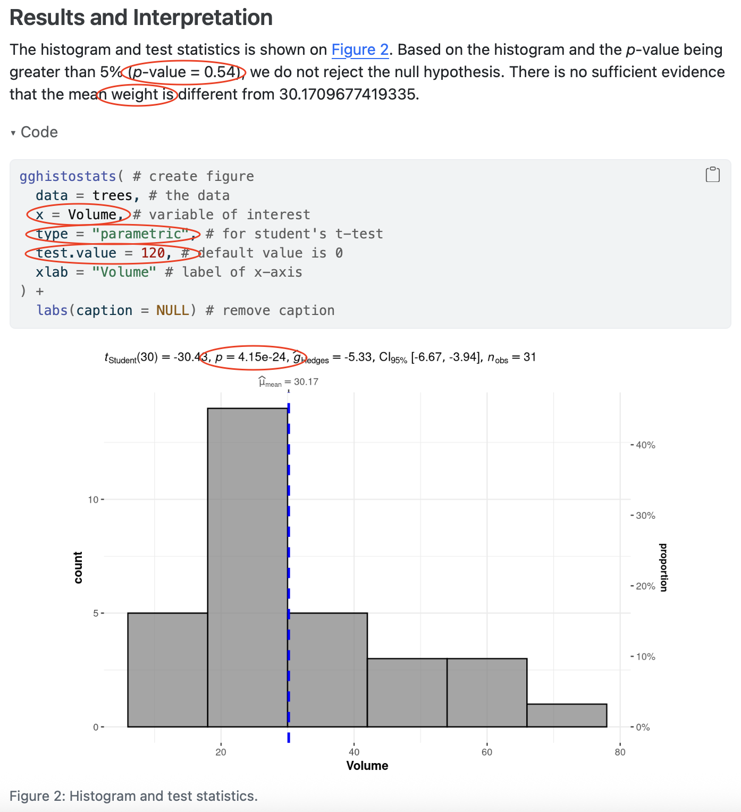{width=60%}

:::
::::

::: notes
Overall, most students performed well in their R and RStudio reports, though some still need additional support.
Students were generally able to present and describe data correctly, but common issues included poor table introduction and improper formatting.
Difficulties were evident in visualization, hypothesis formulation, and assumption checking, indicating gaps in deeper understanding.
Errors in interpretation showed the need for better alignment between code, output, and conclusions.
While writing quality was generally good, limited attempts at complex tasks suggest low confidence in applying statistical thinking using R and RStudio.
Some mistakes were Mismatched variables, mistakes in Results and Interpretation
:::

---

#### Effect of Using MS Excel in the Performance of Students in Data Management

:::: {.columns}
::: {.column width="65%"}
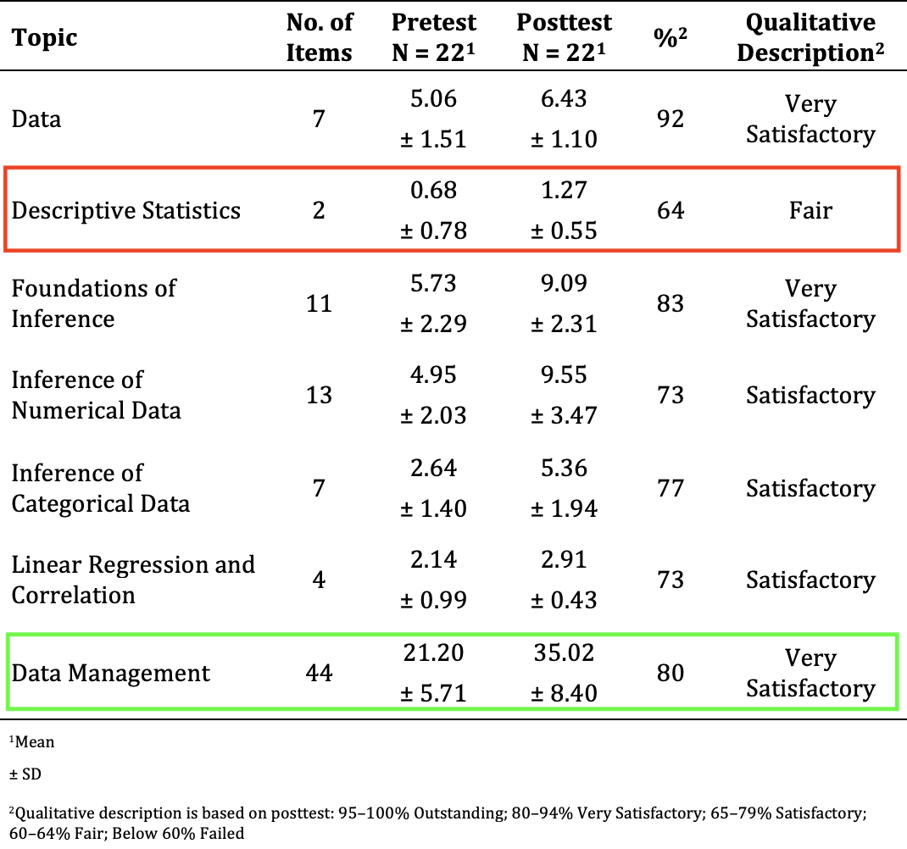{width=80%}
:::
::: {.column width="35%"}
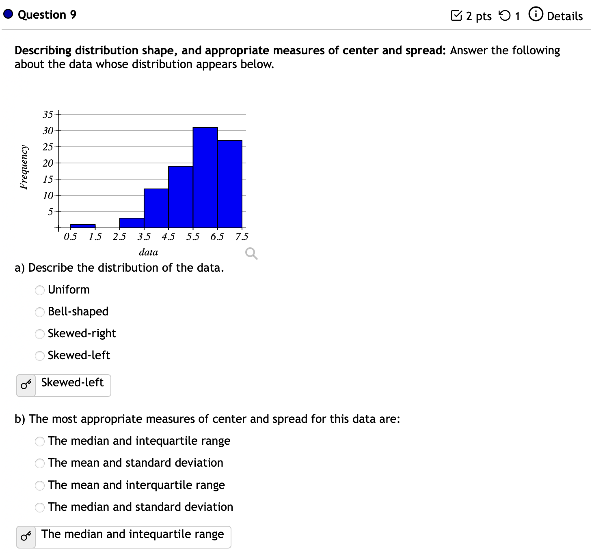{width=60%}

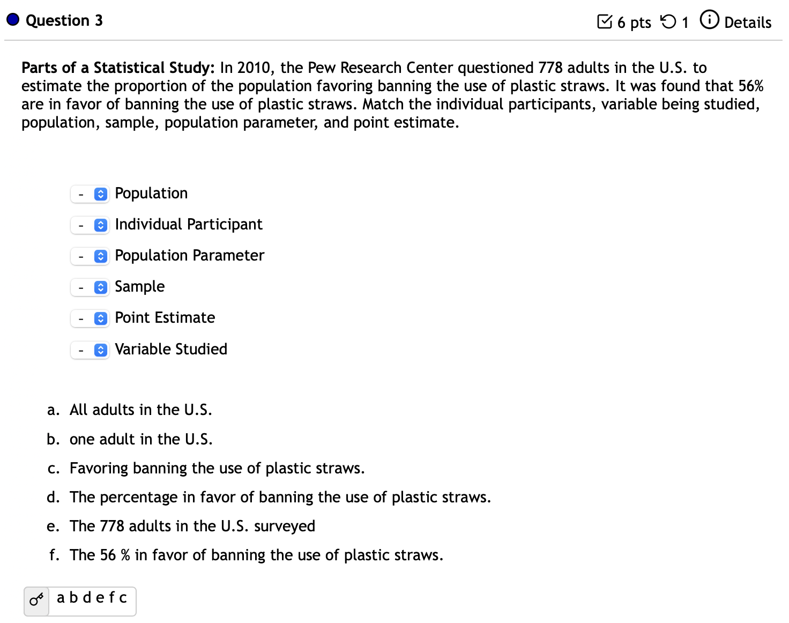{width=60%}

:::
::::

::: notes
Overall, the MS Excel group showed satisfactory performance in the posttest, with most topics rated satisfactory to very satisfactory, except for descriptive statistics.
At the item level, most questions were easy, indicating a good grasp of basic concepts like graphs and hypothesis writing.
However, some students struggled with variable identification, distribution analysis, test selection, and interpretation of results, especially in more complex tasks like hypothesis testing.
While Excel proved to be a useful tool, the findings highlight the need for strong instructional support and improved statistical reasoning, particularly for more advanced concepts.
Here are some items where the students struggled.
:::

---

#### Effect of Using R and RStudio in the Performance of Students in Data Management

:::: {.columns}
::: {.column width="65%"}
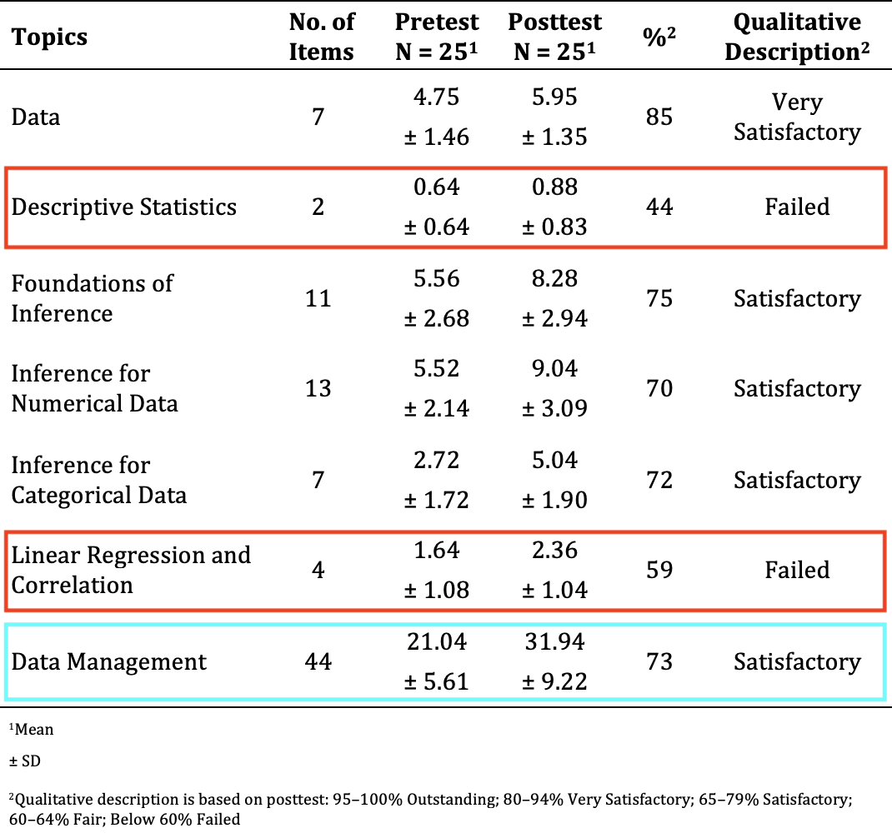{width=80%}
:::
::: {.column width="35%"}
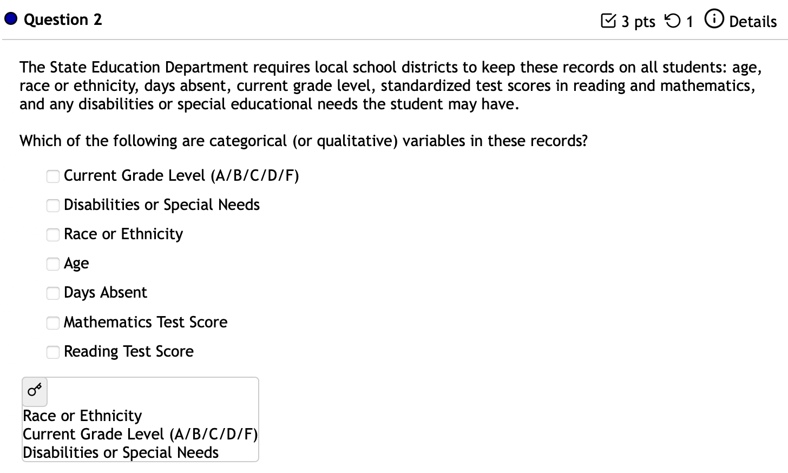{width=100%}

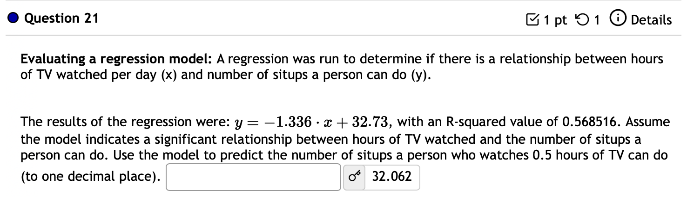{width=100%}

:::
::::

::: notes
Overall, the R and RStudio group showed satisfactory posttest performance, with most topics rated satisfactory to very satisfactory, except for descriptive statistics and linear regression and correlation, where students performed poorly.
At the item level, most questions were easy, though eight were moderately difficult. Students struggled with variable classification, statistical concepts, correlation interpretation, test selection, and hypothesis formulation.
Difficulties were also observed in confidence intervals, regression predictions, and multi-step hypothesis testing, indicating gaps in statistical reasoning.
These results highlight the need for stronger scaffolding, targeted support, and improved instructional design to enhance students’ data management and analytical skills using R and RStudio.
Here are some items where the students struggled.
:::

---

#### Effect of Using MS Excel or RStudio in the Performance of Students in Data Management

::: {style="font-size: 0.7em;"}
Comparison of Mean Pretest Scores and Mean Posttest Scores in Each Group

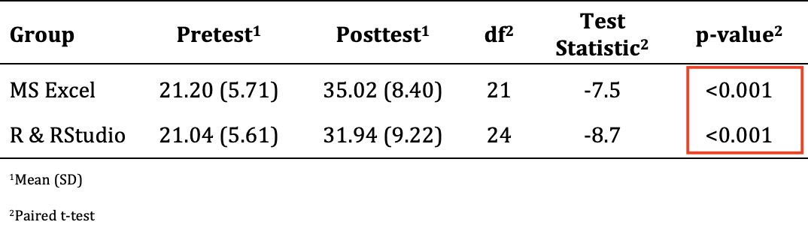{width=70%}

Quade’s Test Result on Comparison between Performance using R and RStudio or Microsoft Excel with Pretest Scores as Covariate

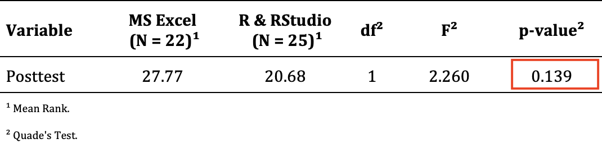{width=70%}

:::

::: notes
Both groups showed significant improvement from pretest to posttest, as indicated by the paired t-test results (p < 0.001).
However, when comparing posttest performance using Quade’s test, there was no statistically significant difference between the MS Excel and R/RStudio groups (p = 0.139).
This suggests that while both instructional approaches were effective in improving student performance, neither group performed significantly better than the other after adjusting for pretest scores.
:::

---

#### Experiences of the Students in Using MS Excel or  RStudio.

::: {style="font-size: 0.7em;"}
Summary of Themes for Students’ Experience in Using MS Excel or R and RStudio
:::

:::: {.columns}
::: {.column width="50%"}

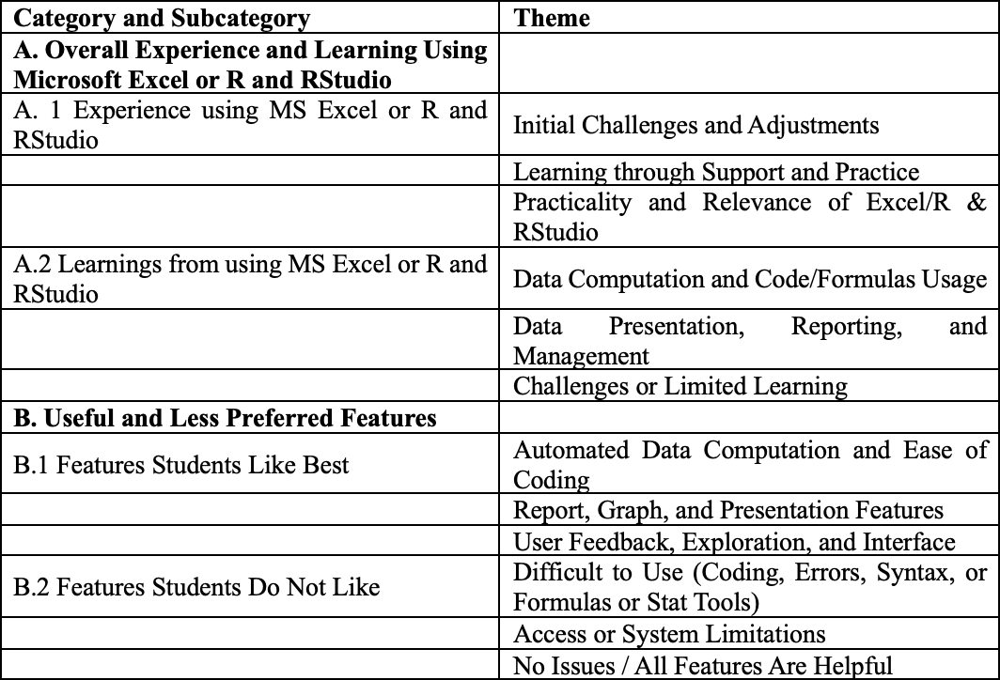

:::
::: {.column width="50%"}

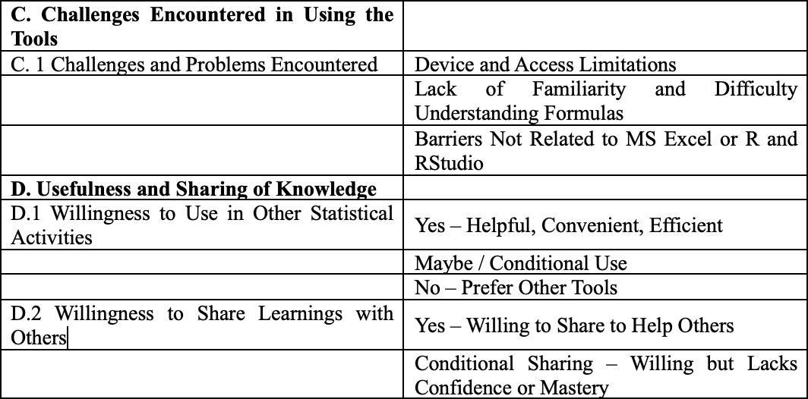

:::
::::

::: notes
Students’ experiences revealed themes on initial challenges, learning through practice, and the practical value of MS Excel and R/RStudio.
They appreciated automation and data presentation features, but faced issues with syntax, access, and familiarity.
Overall, most students were willing to use and share their learning, though some lacked confidence in applying the tools independently.
:::

---

#### Metacognitive Skills of Students in Decision-making

::: {style="font-size: 0.7em;"}
Means and Standard Deviations of the Students’ Metacognitive Skills in Using Microsoft Excel or R and RStudio
:::

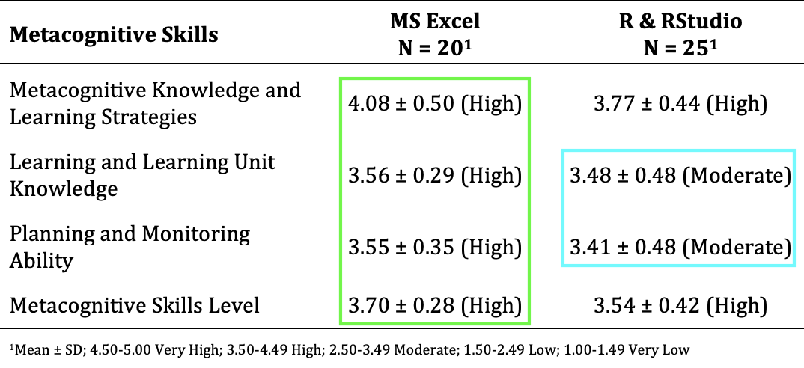

::: notes
The results show that both groups generally demonstrated high levels of metacognitive skills.
For MS Excel, all domains were rated high, with an overall mean of 3.70. For R and RStudio, the overall level was also high at 3.54, although learning and learning unit knowledge and planning and monitoring were rated only moderate.
Overall, this indicates that students in both groups showed good metacognitive awareness, but the R/RStudio group may need more support in planning, monitoring, and understanding learning tasks.
:::

---

#### Proposed Training Design on the Use of Statistical Programming Language in Teaching Coding and Data Management

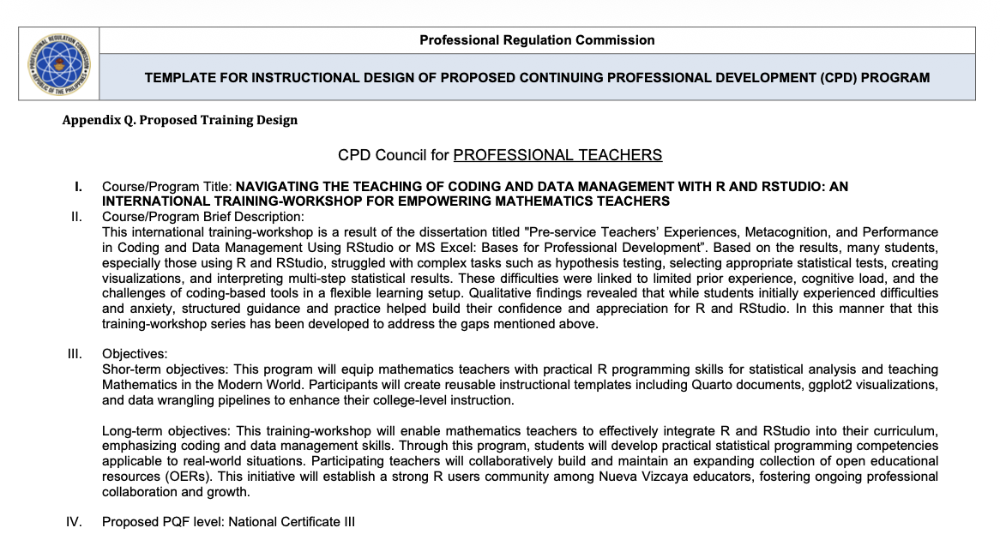

::: notes
The title of the proposed training is “Navigating the Teaching of Coding and Data Management with R and RStudio”
The training program is an international workshop designed to enhance teachers’ skills in coding and data management using R and RStudio.
It was developed based on identified learner challenges and guided by the PRC CPD framework.
The program includes modules on R and RStudio basics, data visualization, data wrangling, hypothesis testing, and Quarto-based instructional materials.
Each module integrates lectures and hands-on activities to support practical application and teaching integration.
:::

# Conclusions & Recommendations {background-image="images/bg.jpeg" background-opacity="0.2"}

## Conclusions {.smaller}

- R and RStudio group showed **satisfactory coding and data management performance**, but students still struggled with **higher-order statistical reasoning** (e.g., testing, interpretation, visualization, and research formulation), indicating need for **guided and scaffolded instruction**.
- The integration of **MS Excel and R/RStudio enhanced student performance**, with Excel supporting foundational learning and R/RStudio developing advanced analytical skills.
- Students had **mixed experiences**: Excel was easier and familiar, while R/RStudio was more challenging but useful; despite difficulties, most gained skills and were willing to reuse and share them.
- Students demonstrated **moderate to high metacognitive skills**, with slightly higher levels among MS Excel users, suggesting familiarity supports learning regulation.
- The proposed **CPD training program** addresses identified gaps and supports effective integration of R and RStudio in mathematics education.

::: notes
Overall, the study concludes that students performed satisfactorily in R and RStudio but still need support in higher-level statistical reasoning.
Both MS Excel and R/RStudio improved learning, serving different roles in skill development.
Students reported mixed but generally positive experiences and showed willingness to continue using and sharing their learning.
Metacognitive skills were moderate to high, with slightly better results for Excel users.
Finally, the proposed CPD training responds to these findings by supporting teachers in effectively integrating R and RStudio in instruction.
:::

## Recommendations {.smaller}

- Adopt a **scaffolded, data-driven approach** in teaching coding and data management using R and RStudio, with real-world applications and timely feedback
- Strengthen the **K to 12 curriculum** to emphasize coding and statistical reasoning aligned with Industry 5.0 skills
- Integrate **MS Excel and R/RStudio strategically**, supported by training, infrastructure, and project-based learning
- Provide **step-by-step instruction and peer support**, ensuring access to devices and internet connectivity
- Enhance **metacognitive skills development** through reflective activities, guided practice, and learning strategy monitoring
- Implement the **proposed CPD training program** to upskill teachers in R and RStudio with hands-on, collaborative learning

::: notes
The recommendations focus on improving instruction in coding and data management through scaffolded learning and real-world applications.
They also highlight strengthening curriculum support, integrating MS Excel and R/RStudio effectively, and ensuring adequate training and resources.
Students should be guided through structured practice, peer support, and reflective activities to build confidence and skills.
Finally, the proposed CPD training is recommended to equip teachers with practical skills in using R and RStudio.
:::

# Post-Study Impact {background-image="images/bg.jpeg" background-opacity="0.2"}

## Research Extension and Community Engagement

- Formation of the **R User Group of Nueva Vizcaya State University (RNVSU)**
- Supported through funding from the **R Consortium**
- Organized **5 international learning events/webinars**
- Featured speakers from the **global R user community**
- Promotes a **community of practice** for continued learning, collaboration, and capacity building in R programming

::: notes
As an extension of the study, the RNVSU was established with support from the R Consortium.
The group has already organized five events featuring international speakers from the R community.
This initiative promotes continuous learning and strengthens collaboration in R programming and data science.
:::

---

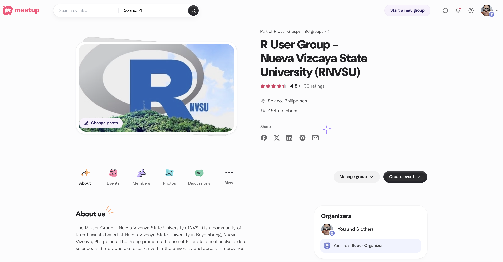

---

:::: {.columns}
::: {.column width="85%"}

:::
::: {.column width="15%"}

:::
::::

# Thank you! {background-image="images/bg.jpeg" background-opacity="0.2"}

## References